<br/>

<p align="center">
  
</p>

<h1 align="center">Cluster Monitoring with Operators on AKS</h1>

<p align="center">
  <i>Prometheus, Alertmanager and Grafana deployed by the Prometheus operator, TLS certificates issued by cert-manager, Grafana exposed through an HTTPS reverse proxy</i>
</p>

<p align="center"><sub>Contributors</sub></p>

<p align="center">
  <a href="https://github.com/WhiteMuush"></a>
  <a href="https://github.com/jaims-31"></a>
</p>

<br/>

---

<br/>

<h2 align="center">Architecture</h2>

<br/>

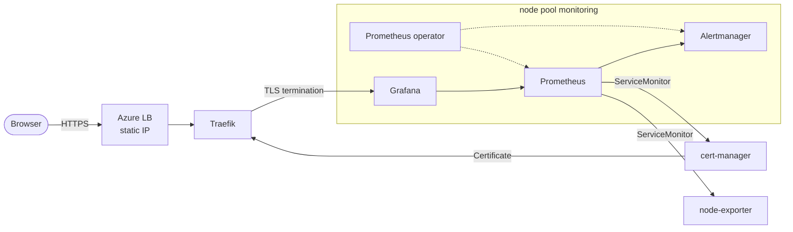

**Terraform** provisions the AKS cluster, a dedicated `monitoring` node pool (tainted, so only the stack runs there) and a static public IP that survives Service deletions.

**cert-manager** issues a self-signed TLS certificate for the domain. **kube-prometheus-stack** deploys Prometheus, Alertmanager, node-exporter and Grafana through the Prometheus operator. **Traefik** terminates HTTPS and serves Grafana on the public IP.

Prometheus discovers its targets through **ServiceMonitors**, not static config. node-exporter tolerates every taint to run on every node. Prometheus, Alertmanager and Grafana persist their data on Azure disks (`managed-csi`).

<br/>

---

<br/>

<h2 align="center">Grafana over HTTPS</h2>

<br/>

<p align="center">
  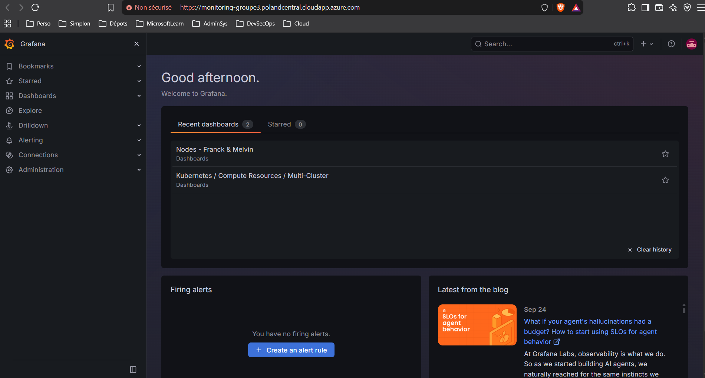
</p>

<p align="center">
  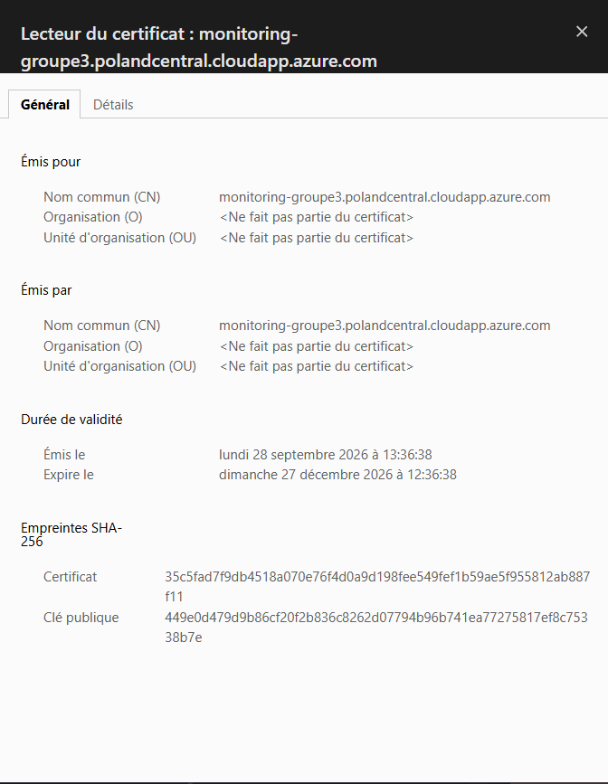
</p>

<p align="center">
  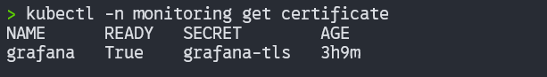
</p>

<br/>

---

<br/>

<h2 align="center">Load Balancer, Traefik and persistence</h2>

<br/>

<p align="center">
  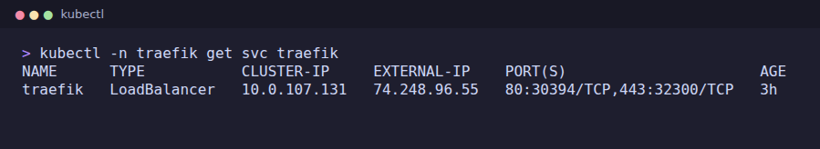
</p>

<p align="center">
  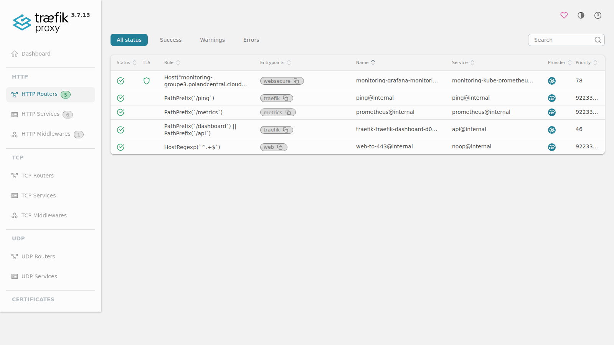
</p>

<p align="center">
  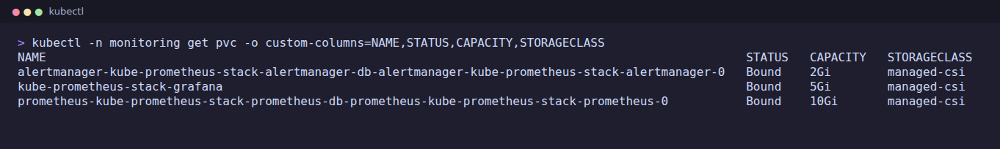
</p>

<br/>

---

<br/>

<h2 align="center">Prometheus targets</h2>

<br/>

<p align="center">
  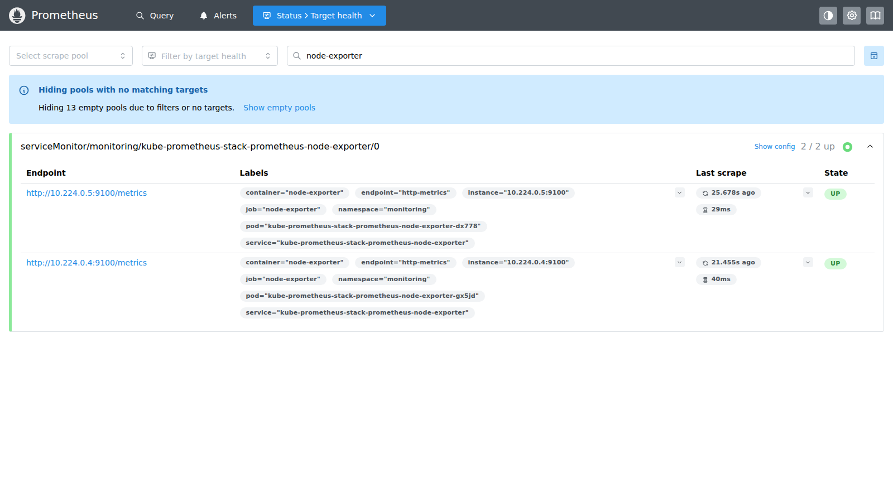
</p>

<p align="center">
  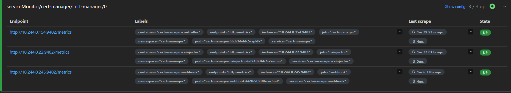
</p>

<br/>

---

<br/>

<h2 align="center">Alerts</h2>

<br/>

Two PrometheusRules in `k8s/monitoring/`, picked up by the operator.

| Alert | Fires when | Severity |
|---|---|---|
| `PodCrashLooping` | More than 2 restarts in 10 min | critical |
| `PodNotReady` | Pod pending, unknown or failed for 10 min | warning |
| `PodImagePullError` | Image pull failing for 5 min | warning |
| `ContainerOOMKilled` | Container killed by OOM | warning |
| `CertManagerDown` | cert-manager unreachable for 10 min | critical |
| `CertificateNotReady` | Certificate not ready for 10 min | critical |
| `CertificateExpiringSoon` | Less than 21 days before expiry | warning |
| `CertificateExpired` | Certificate has expired | critical |

<p align="center">
  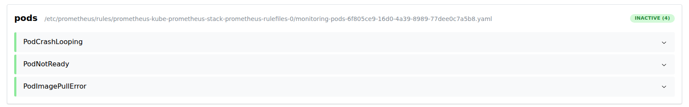
</p>

<p align="center">
  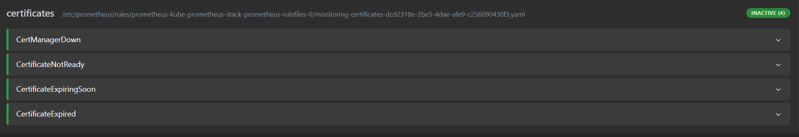
</p>

<p align="center">
  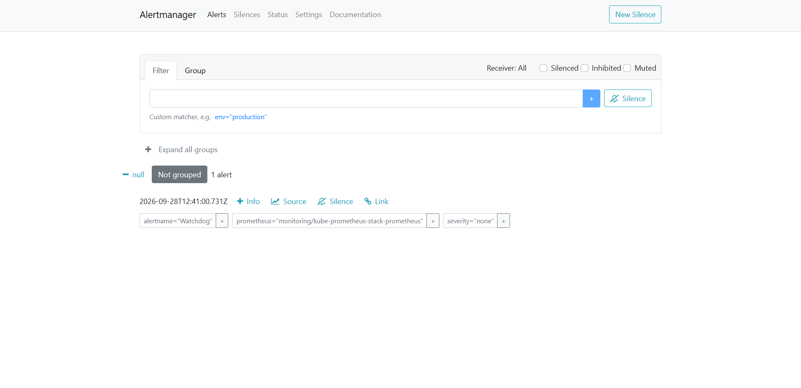
</p>

<br/>

---

<br/>

<h2 align="center">Health report</h2>

<br/>

<p align="center">
  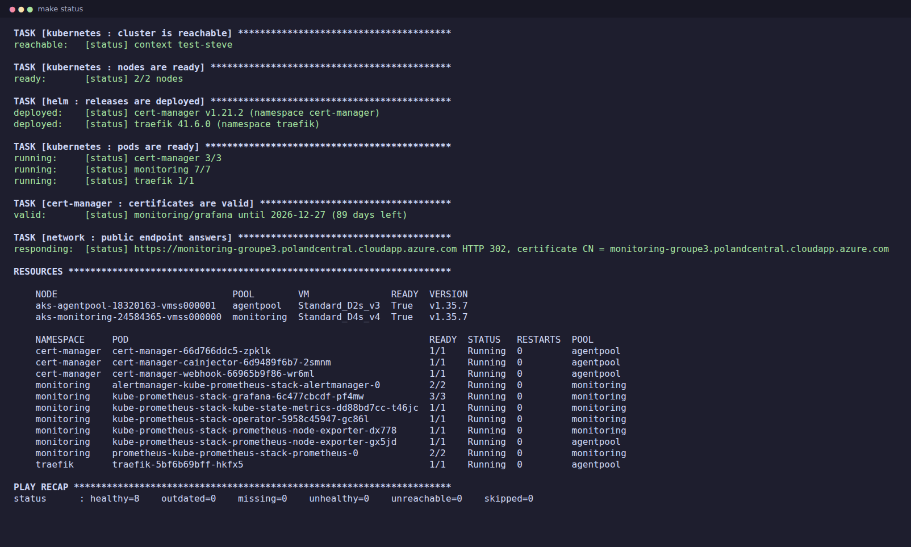
</p>

<br/>

---

<br/>


<h2 align="center">Demo</h2>

<br/>

`make` opens an interactive menu with the cluster state and every available target.

<p align="center">
  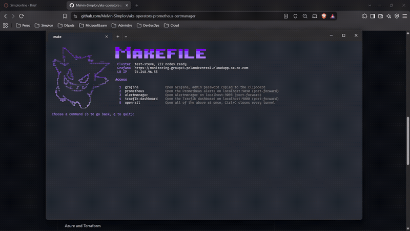
</p>

<br/>

Each step depends on the previous one.

1. `make tf-apply` : provision the Azure infrastructure
2. `make cert-manager` : install cert-manager
3. `make certificates` : create the ClusterIssuer and the Grafana certificate
4. Install kube-prometheus-stack (no make target yet, see `helm/kube-prometheus-stack/`)
5. `make traefik` : install the reverse proxy on the static IP
6. `make ingress` : expose Grafana over HTTPS
7. `make alerts` : apply alert rules for pods and certificates
8. `make dashboards` : load the Grafana dashboards

Every step is idempotent: re-running with an unchanged config does nothing.

<br/>

| Target | Opens |
|---|---|
| `make grafana` | Grafana in the browser, admin password copied to clipboard |
| `make prometheus` | Prometheus on localhost:9090 (port-forward) |
| `make alertmanager` | Alertmanager on localhost:9093 (port-forward) |
| `make traefik-dashboard` | Traefik dashboard on localhost:9000 (port-forward) |

`make status` prints a read-only health report of the whole stack.

<br/>

---

<br/>

<h2 align="center">Project layout</h2>

<br/>

```
.
├── Makefile                  Entry point, `make` opens the interactive menu
├── makefiles/                One .mk per menu section
├── scripts/                  Bash logic behind each target
│   ├── lib.sh                Ansible-style output helpers, log file
│   ├── menu.sh               Interactive menu
│   ├── kube.sh               Kubernetes helpers
│   ├── helm.sh               Helm helpers, config checksum
│   ├── terraform.sh          init, fmt, validate, plan, apply
│   ├── helm-release.sh       Idempotent Helm install/upgrade
│   ├── k8s-apply.sh          Apply a k8s/<dir>/, wait for Ready
│   ├── status.sh             Health report
│   ├── grafana.sh            Open Grafana, copy admin password
│   ├── open-ui.sh            Port-forward to internal UIs
│   └── browser.sh            Open a URL in the browser
├── terraform/                AKS cluster, node pool, static IP
├── helm/
│   ├── cert-manager/         release.env + values.yaml
│   ├── kube-prometheus-stack/ values.yaml
│   └── traefik/              release.env + values.yaml
├── k8s/
│   ├── namespaces/
│   ├── cert-manager/         ClusterIssuer + Certificate
│   ├── monitoring/           PrometheusRules
│   ├── grafana/              Dashboard JSON, loaded as ConfigMaps
│   └── ingress/              Grafana Ingress
└── docs/
```

<br/>

---

<br/>

<h2 align="center">Documentation</h2>

<br/>

- [Azure Kubernetes Service](https://learn.microsoft.com/en-us/azure/aks/) · [Static public IP](https://learn.microsoft.com/en-us/azure/aks/static-ip)
- [Terraform import](https://developer.hashicorp.com/terraform/language/import) · [azurerm_kubernetes_cluster](https://registry.terraform.io/providers/hashicorp/azurerm/latest/docs/resources/kubernetes_cluster)
- [cert-manager](https://cert-manager.io/docs/installation/helm/) · [SelfSigned issuer](https://cert-manager.io/docs/configuration/selfsigned/) · [Certificate](https://cert-manager.io/docs/usage/certificate/)
- [Traefik](https://doc.traefik.io/traefik/) · [Traefik Helm chart](https://github.com/traefik/traefik-helm-chart)
- [Prometheus operator](https://prometheus-operator.dev/) · [kube-prometheus-stack](https://github.com/prometheus-community/helm-charts/tree/main/charts/kube-prometheus-stack) · [Grafana](https://grafana.com/docs/grafana/latest/)

<br/>

---

<br/>

<p align="center"><sub>Brief in <a href="docs/CONSIGNES.md">docs/CONSIGNES.md</a></sub></p>
